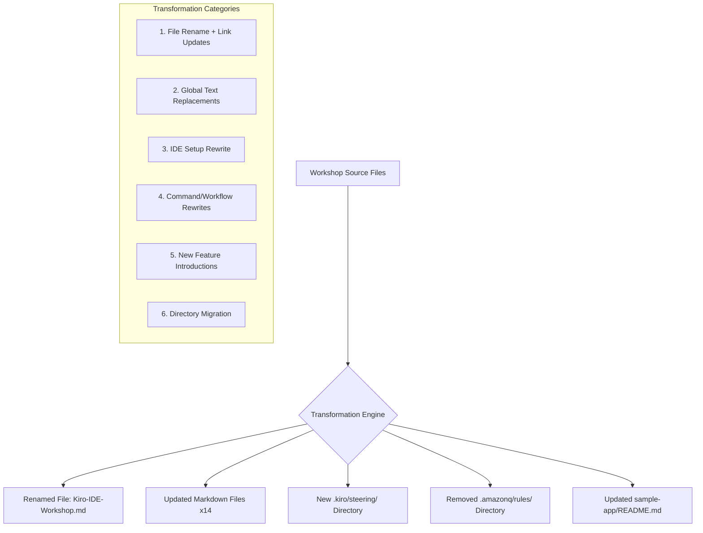
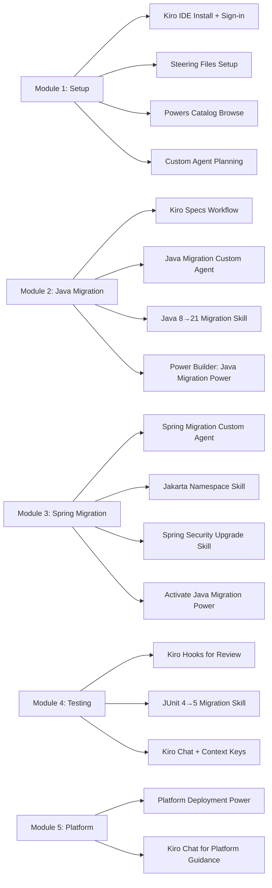

# Design Document: Kiro IDE Workshop Transformation

## Overview

This design describes the transformation of the Java Framework Migration Workshop from Amazon Q Developer IDE Extension to AWS Kiro IDE. The workshop's core mission—guiding teams through migrating Java 8 + Spring 5.2.3 to Java 21 + Spring 6—remains unchanged. The transformation replaces all Amazon Q Developer tooling references, commands, and workflows with Kiro IDE equivalents (Specs, Hooks, Steering, Skills, Custom Agents, Powers, Chat, Code Suggestions, Context Keys) across 14+ markdown files, the sample-app README, and the `.amazonq/rules/` directory.

The transformation is a content rebrand with feature mapping: every Amazon Q capability referenced in the workshop maps to one or more Kiro IDE features. The sample application source code and all Java/Spring/platform technical content remain untouched.

### Key Design Decisions

1. **File rename**: `Amazon-Q-Developer-IDE-Workshop.md` → `Kiro-IDE-Workshop.md` is the only file rename; all other files keep their names to minimize link breakage.
2. **Directory migration**: `.amazonq/rules/memory-bank/` content migrates to `.kiro/steering/*.md` files with adapted content.
3. **Feature mapping**: `/transform` → Kiro Specs workflow; `/review` → Kiro Hooks; Q Chat → Kiro Chat with Context Keys; inline suggestions → Kiro Code Suggestions.
4. **New Kiro features introduced per module**: Skills, Custom Agents, and Powers are woven into the modules where they are most relevant, not bolted on as separate sections.
5. **Standalone IDE framing**: All references to VS Code/IntelliJ extension installation are replaced with Kiro IDE download/install/sign-in, since Kiro is a standalone IDE.

## Architecture

The transformation operates on a flat collection of markdown files and one directory structure. There is no runtime application architecture—this is a documentation transformation project.

### Transformation Flow



### Module-to-Feature Mapping



## Components and Interfaces

### Component 1: File Rename and Link Update

Renames `Amazon-Q-Developer-IDE-Workshop.md` to `Kiro-IDE-Workshop.md` and updates all cross-references across every markdown file.

**Files affected**: All markdown files that link to the old filename.

**Interface**: Find all occurrences of `Amazon-Q-Developer-IDE-Workshop.md` in link targets and replace with `Kiro-IDE-Workshop.md`.

### Component 2: Global Text Replacement Engine

Applies ordered text replacements across all markdown files. Order matters to avoid double-replacement (e.g., "Amazon Q Developer" must be replaced before standalone "Amazon Q").

**Replacement order** (longest match first):
1. `Amazon Q Developer IDE Extension` → `Kiro IDE`
2. `Amazon Q Developer IDE` → `Kiro IDE`
3. `Amazon Q Developer` → `Kiro IDE`
4. `Q Developer` → `Kiro IDE`
5. `Amazon Q` → `Kiro` (only standalone, not part of already-handled phrases)
6. `Q Chat` → `Kiro Chat`
7. `Q icon` → `Kiro icon`
8. `Q panel` → `Kiro panel`
9. `Ask Q:` → `Ask Kiro:`
10. `Ask Q ` → `Ask Kiro `

**Exclusions**: Java code blocks, Maven XML, and shell commands that don't reference Q Developer features.

### Component 3: IDE Setup Rewrite (Module 1 + PARTICIPANT-SETUP.md)

Replaces VS Code/IntelliJ extension installation with Kiro IDE standalone installation:
- Download Kiro IDE from [Kiro IDE Download URL]
- Install and launch Kiro IDE
- Sign in with Kiro account (replaces Builder ID / IAM Identity Center)
- Open workspace and verify Kiro Chat responds

### Component 4: Command/Workflow Rewrites

| Old Command/Workflow | New Kiro Equivalent | Affected Files |
|---|---|---|
| `/transform` command | Kiro Specs workflow (requirements → design → tasks) | Module 2, Quick Reference, Workshop main doc |
| `/review` command | Kiro Hooks (automated on file save) + Kiro Chat for on-demand review | Module 4, Quick Reference, Workshop main doc |
| Command Palette → "Amazon Q: Transform" | Kiro Specs creation and task execution | Module 2, Workshop Agenda |
| Command Palette → "Amazon Q: Review Code" | Kiro Hooks configuration | Module 4 |
| Q Chat queries | Kiro Chat with Context Keys (#File, #Folder, #Problems, #Terminal, #Git Diff) | All modules |
| Inline suggestions | Kiro Code Suggestions | All modules |

### Component 5: New Feature Introductions

Each module introduces Kiro-specific features:

**Module 1**: Steering files (`.kiro/steering/`), Powers catalog browsing, Custom Agent planning
**Module 2**: Kiro Specs, Java Migration Custom Agent, Java 8→21 Migration Skill, Power Builder (Java Migration Power)
**Module 3**: Spring Migration Custom Agent, Jakarta Namespace Migration Skill, Spring Security Upgrade Skill, activate Java Migration Power
**Module 4**: Kiro Hooks, JUnit 4→5 Migration Skill, Kiro Chat with #Problems and #Git Diff Context Keys
**Module 5**: Platform Deployment Power, Kiro Chat for platform guidance

### Component 6: Directory Migration

Migrates `.amazonq/rules/memory-bank/` to `.kiro/steering/`:

| Old File | New File | Content Adaptation |
|---|---|---|
| `.amazonq/rules/memory-bank/product.md` | `.kiro/steering/project-context.md` | Reframe as Kiro steering context for the migration project |
| `.amazonq/rules/memory-bank/tech.md` | `.kiro/steering/tech-stack.md` | Migration targets and dependency versions as steering guidance |
| `.amazonq/rules/memory-bank/guidelines.md` | `.kiro/steering/coding-guidelines.md` | Code patterns and conventions as Kiro steering rules |
| `.amazonq/rules/memory-bank/structure.md` | `.kiro/steering/project-structure.md` | Architecture and structure as Kiro steering context |

### Component 7: Feature Summary Table Updates

Each module's "Key Q Developer Commands Used" table becomes "Key Kiro IDE Features Used" with entries for all Kiro features introduced in that module (Specs, Hooks, Chat, Code Suggestions, Skills, Custom Agents, Powers).

### Component 8: Quick Reference Guide Overhaul

The Quick Reference Guide receives the most significant structural changes:
- "Essential Q Developer Commands" table → "Kiro IDE Features" table
- "Using /transform" → "Using Kiro Specs"
- "Using /review" → "Using Kiro Hooks"
- "Q Developer Pro Tips" → "Kiro IDE Tips"
- New sections: "Kiro Skills", "Kiro Custom Agents", "Kiro Powers"
- Example queries updated to use Kiro Chat with Context Keys


## Data Models

This is a documentation transformation project—there are no runtime data models, databases, or APIs. The "data" is the set of markdown files and their content.

### File Inventory

| File | Rename? | Transformation Scope |
|---|---|---|
| `Amazon-Q-Developer-IDE-Workshop.md` | Yes → `Kiro-IDE-Workshop.md` | Full rewrite: branding, commands, features |
| `README.md` | No | Badges, branding, feature descriptions, links |
| `Module-1-Environment-Setup.md` | No | IDE setup rewrite, steering files, Powers, Custom Agent planning |
| `Module-2-Java-Migration.md` | No | /transform → Specs, Custom Agent, Skill, Power Builder |
| `Module-3-Spring-Migration.md` | No | Custom Agent, Skills (Jakarta, Security), Power activation |
| `Module-4-Testing-Validation.md` | No | /review → Hooks, Skill (JUnit), Context Keys |
| `Module-5-Platform-Validation.md` | No | Platform Deployment Power, Chat updates |
| `Quick-Reference-Guide.md` | No | Major overhaul: features table, new sections for Skills/Agents/Powers |
| `Workshop-Agenda.md` | No | Branding, session descriptions |
| `PARTICIPANT-SETUP.md` | No | IDE setup rewrite (standalone Kiro IDE) |
| `INSTRUCTOR-QUICK-START.md` | No | Branding, demo instructions for Kiro features |
| `TRAINING-KICKSTART.md` | No | Branding, verification steps |
| `Developer-Test-Walkthrough.md` | No | Branding, feature references |
| `ACTUAL-TEST-RESULTS.md` | No | Branding, feature references |
| `sample-app/README.md` | No | Branding, feature references |
| `.amazonq/rules/memory-bank/*.md` | Migrate → `.kiro/steering/*.md` | Content adaptation to steering format |

### Text Replacement Map

The global replacement map is applied in order (longest match first to prevent partial replacements):

```
Priority 1 (Exact phrases - longest first):
  "Amazon Q Developer IDE Extension" → "Kiro IDE"
  "Amazon Q Developer IDE extension" → "Kiro IDE"
  "Amazon Q Developer IDE" → "Kiro IDE"
  "Amazon Q Developer" → "Kiro IDE"
  "Q Developer" → "Kiro IDE"

Priority 2 (Standalone references):
  "Amazon Q" → "Kiro" (when not part of a URL or already-handled phrase)

Priority 3 (Feature-specific):
  "Q Chat" → "Kiro Chat"
  "Q icon" → "Kiro icon"
  "Q panel" → "Kiro panel"
  "Ask Q:" → "Ask Kiro:"
  "Ask Q " → "Ask Kiro "
  "ask Q:" → "ask Kiro:"
  "ask Q " → "ask Kiro "

Priority 4 (Authentication):
  "AWS Builder ID" → "Kiro account"
  "IAM Identity Center" → "Kiro account"
  "Builder ID" → "Kiro account" (standalone)

Priority 5 (Commands):
  "/transform" → "Kiro Specs" (in descriptive text, not code blocks showing old behavior)
  "/review" → "Kiro Hooks" (in descriptive text)
  "Amazon Q: Transform" → "Kiro Specs workflow"
  "Amazon Q: Review Code" → "Kiro Hooks"
  "Amazon Q: Review" → "Kiro Hooks"

Priority 6 (Badges/URLs):
  Amazon Q badge URLs → Kiro IDE badge URLs or remove
  Amazon Q documentation URLs → Kiro IDE documentation URLs or placeholder
```

### Kiro Feature Definitions for Workshop Content

**Kiro Specs** (replaces /transform):
- Create requirements document defining migration scope
- Generate design document with migration strategy
- Break down into executable tasks
- Track progress through task completion

**Kiro Hooks** (replaces /review):
- Configure automated review triggers on file save
- Continuous code quality and security feedback
- On-demand review via Kiro Chat with #Git Diff

**Kiro Steering Files** (replaces .amazonq/rules/):
- `.kiro/steering/*.md` files providing project context
- Migration scope, target versions, constraints
- Coding guidelines and patterns

**Kiro Skills** (new):
- Java 8→21 Migration Skill: automates Date API, deprecated API patterns
- Jakarta Namespace Migration Skill: automates javax→jakarta across files
- Spring Security Upgrade Skill: WebSecurityConfigurerAdapter → SecurityFilterChain
- JUnit 4→5 Migration Skill: annotation conversion, assertion updates

**Kiro Custom Agents** (new):
- Java Migration Agent: specialized for Java 8→21 transformation
- Spring Migration Agent: specialized for Spring 5→6 and Jakarta namespace

**Kiro Powers** (new):
- Java Framework Migration Power: packages migration docs, steering files, optional MCP server
- Platform Deployment Power: bundles JBoss/WebSphere/Mainframe deployment knowledge

**Kiro Chat with Context Keys** (replaces Q Chat):
- #File: reference specific files for targeted guidance
- #Folder: reference entire packages for bulk operations
- #Problems: share compilation errors for troubleshooting
- #Terminal: share terminal output
- #Git Diff: share changes for review


## Correctness Properties

*A property is a characteristic or behavior that should hold true across all valid executions of a system—essentially, a formal statement about what the system should do. Properties serve as the bridge between human-readable specifications and machine-verifiable correctness guarantees.*

### Property 1: No old filename references remain in links

*For any* markdown file in the transformed workshop, no link target (href or markdown link) should contain the string `Amazon-Q-Developer-IDE-Workshop.md`. All such references must point to `Kiro-IDE-Workshop.md`.

**Validates: Requirements 1.2, 17.1**

### Property 2: No Q Developer terminology remains

*For any* markdown file in the transformed workshop, the file content should not contain any of the following strings outside of preserved code blocks: "Amazon Q Developer", "Q Developer", "Amazon Q" (standalone), "Q Chat", "Q icon", "Q panel", "Ask Q:", "Amazon Q: Transform", "Amazon Q: Review Code", or "Amazon Q: Review". All such occurrences must have been replaced with their Kiro equivalents.

**Validates: Requirements 2.1, 2.2, 2.3, 2.4, 2.5, 4.2, 5.4, 6.3, 6.5, 8.1**

### Property 3: No extension installation or legacy authentication references remain

*For any* markdown file in the transformed workshop, the file should not contain instructions to install an Amazon Q extension in VS Code or IntelliJ, nor should it reference "AWS Builder ID" or "IAM Identity Center" as authentication methods. All such references must be replaced with Kiro IDE standalone installation and Kiro account sign-in.

**Validates: Requirements 3.2, 3.3**

### Property 4: Feature introduction completeness across modules

*For any* Kiro feature introduced in the workshop (Skills: Java 8→21, Jakarta Namespace, Spring Security, JUnit 4→5; Custom Agents: Java Migration, Spring Migration; Powers: Java Framework Migration, Platform Deployment), the feature must appear both in the module where it is most relevant AND in the Quick Reference Guide with its purpose described.

**Validates: Requirements 10.2, 11.2, 12.2**

### Property 5: Feature documentation completeness

*For any* Kiro Skill introduced in a module, the introduction must include: (a) what the skill automates, (b) how to create it, and (c) when/how to invoke it. *For any* Custom Agent introduced, the introduction must include: (a) purpose and expertise scope, (b) how to create and configure it, and (c) best practices. *For any* Power introduced, the introduction must include: (a) purpose and contents, (b) how to install or build it, (c) how to activate and use it, and (d) how to share it.

**Validates: Requirements 7.5, 10.3, 11.3**

### Property 6: Feature summary tables correctly updated

*For any* module file containing a feature summary table, the table header should read "Key Kiro IDE Features Used" (not "Key Q Developer Commands Used"), and the table should not contain `/transform`, `/review`, "Q Chat", or "Inline suggestions" as entries. Instead it should contain their Kiro equivalents ("Kiro Specs", "Kiro Hooks", "Kiro Chat", "Kiro Code Suggestions"). Additionally, if the module introduces a Skill, Custom Agent, or Power, the table must include an entry for each.

**Validates: Requirements 14.1, 14.2, 14.3, 14.4, 14.5**

### Property 7: Technical content preservation

*For any* Java source file in `sample-app/src/`, its content must be identical before and after the transformation. *For any* fenced code block in a markdown file that contains Java code, Maven XML, Spring XML configuration, shell commands (not referencing Q Developer features), or platform deployment XML, the code block content must remain unchanged by the transformation.

**Validates: Requirements 16.1, 16.3, 16.4**

### Property 8: Internal non-renamed links preserved

*For any* internal markdown link pointing to a file that was not renamed (i.e., any file other than `Amazon-Q-Developer-IDE-Workshop.md`), the link target must remain unchanged after transformation.

**Validates: Requirements 17.2**

### Property 9: External Q documentation links updated

*For any* external link in the transformed workshop that previously pointed to Amazon Q Developer documentation (e.g., `docs.aws.amazon.com/amazonq`), the link must be replaced with a corresponding Kiro IDE documentation URL or a placeholder `[Kiro IDE Documentation URL]`.

**Validates: Requirements 17.3, 17.4**

## Error Handling

Since this is a documentation transformation (not a runtime application), error handling focuses on transformation correctness:

### Replacement Ordering Errors
The text replacement must be applied in longest-match-first order to prevent partial replacements. For example, replacing "Amazon Q" before "Amazon Q Developer" would produce "Kiro Developer" instead of "Kiro IDE". The replacement engine must process patterns from longest to shortest.

### Code Block Preservation
The transformation must detect fenced code blocks (``` delimiters) and skip text replacements inside code blocks that contain Java, XML, or shell content unrelated to Q Developer features. Code blocks that contain Q Developer command examples (e.g., "Ask Q:" prompts) should still be transformed.

### Link Target Accuracy
When updating link targets from `Amazon-Q-Developer-IDE-Workshop.md` to `Kiro-IDE-Workshop.md`, the transformation must handle all markdown link formats:
- `[text](Amazon-Q-Developer-IDE-Workshop.md)`
- `[text](./Amazon-Q-Developer-IDE-Workshop.md)`
- `[text](Amazon-Q-Developer-IDE-Workshop.md#section)`

### Missing Kiro Documentation URLs
When an Amazon Q Developer documentation URL has no known Kiro equivalent, the transformation must insert a placeholder `[Kiro IDE Documentation URL]` rather than leaving the old URL or removing the link entirely.

### Edge Cases
- Badge/shield image URLs containing "amazonq" should be replaced or removed entirely
- File paths like `.amazonq/rules/` in descriptive text should be updated to `.kiro/steering/`
- The string "Amazon Q" inside a URL (e.g., `https://docs.aws.amazon.com/amazonq/`) should be handled as a URL replacement, not a text replacement

## Testing Strategy

### Dual Testing Approach

This project uses both unit tests and property-based tests for comprehensive validation.

**Unit Tests** (specific examples and edge cases):
- Verify the renamed file `Kiro-IDE-Workshop.md` exists and `Amazon-Q-Developer-IDE-Workshop.md` does not
- Verify `pom.xml` content is byte-identical before and after transformation
- Verify specific sections exist in Quick Reference Guide (Skills, Custom Agents, Powers)
- Verify Module 1 contains steering file setup instructions
- Verify Module 2 contains Kiro Specs workflow and Java Migration Skill
- Verify Module 3 contains Spring Migration Agent and Jakarta Namespace Skill
- Verify Module 4 contains Kiro Hooks and JUnit 4→5 Skill
- Verify `.kiro/steering/` files exist with expected content
- Verify README.md badges are updated

**Property-Based Tests** (universal properties across generated inputs):
- Property-based testing library: **jqwik** (Java) or **fast-check** (if using a Node.js test harness for markdown processing)
- Minimum 100 iterations per property test
- Each test tagged with: **Feature: kiro-ide-workshop-transformation, Property {number}: {property_text}**

**Property test implementations**:

1. **Property 1 test**: Generate random markdown content containing links to `Amazon-Q-Developer-IDE-Workshop.md` in various formats. Apply link replacement. Verify no old links remain and all are updated to `Kiro-IDE-Workshop.md`.

2. **Property 2 test**: Generate random markdown content containing Q Developer terminology mixed with regular text. Apply the global replacement function. Verify none of the Q Developer terms remain in the output (outside preserved code blocks).

3. **Property 3 test**: Generate random markdown content containing VS Code/IntelliJ extension installation steps and Builder ID/IAM Identity Center references. Apply transformation. Verify none remain.

4. **Property 4 test**: For each Kiro feature in the defined set, scan the transformed module files and Quick Reference Guide. Verify each feature appears in at least one module and in the Quick Reference Guide.

5. **Property 5 test**: For each feature introduction found in module files, verify it contains all required documentation elements (varies by feature type: Skill, Agent, or Power).

6. **Property 6 test**: For each module file containing a feature summary table, parse the table and verify the header and entries match Kiro terminology, and that all features introduced in that module are listed.

7. **Property 7 test**: Generate random Java source file content. Run the transformation on a markdown file containing that content in a fenced code block. Verify the code block content is unchanged. Also verify all `sample-app/src/` files are byte-identical.

8. **Property 8 test**: Generate random internal markdown links to non-renamed files. Apply transformation. Verify link targets are unchanged.

9. **Property 9 test**: Generate random markdown content containing Amazon Q documentation URLs. Apply transformation. Verify all are replaced with Kiro equivalents or placeholders.

### Test Configuration
- Each property-based test runs minimum 100 iterations
- Each test is tagged: **Feature: kiro-ide-workshop-transformation, Property {N}: {title}**
- Unit tests cover specific examples, edge cases, and the concrete file inventory
- Property tests verify universal correctness across all valid inputs
